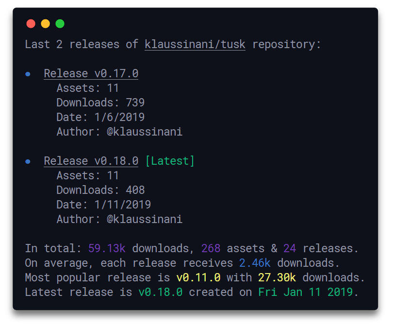

<h1 align="center">
  Rels
</h1>

<h4 align="center">
  Github release analytics for the console
</h4>

<div align="center">
  <a href="https://github.com/klaudiosinani/rels">
    
  </a>
</div>

<p align="center">
  <a href="https://travis-ci.com/klaudiosinani/rels">
    
  </a>
</p>

## Description

By utilizing a simple and minimal usage syntax rels enables you to easily view various analytics & stats regarding the releases of any GitHub repository, displayed in a clean & concise manner, right from within your terminal.

You can now support the development process through [GitHub Sponsors](https://github.com/sponsors/klaudiosinani).

Visit the [contributing guidelines](https://github.com/klaudiosinani/rels/blob/master/contributing.md#translating-documentation) to learn more on how to translate this document into more languages.

## Highlights

- Overall release analytics
- Clean & concise output
- Simple & minimal usage syntax
- Update notifications

## Contents

- [Description](#description)
- [Highlights](#highlights)
- [Install](#install)
- [Usage](#usage)
- [Development](#development)
- [Related](#related)
- [Team](#team)
- [License](#license)

## Install

### Yarn

```bash
yarn global add rels
```

### NPM

```bash
npm install --global rels
```

### Snapcraft

```bash
snap install rels
```

## Usage

```
  Usage
    $ rels [<options> ...]

    Options
      --repo, -r         Repository to get analytics for
      --list, -l         Number of releases to be displayed
      --all, -a          Display all releases
      --help, -h         Display help message
      --version, -v      Display installed version

    Examples
      $ rels --repo klaudiosinani/tusk
      $ rels --repo klaudiosinani/tusk --all
      $ rels --repo klaudiosinani/tusk --list 3
```

## Development

For more info on how to contribute to the project, please read the [contributing guidelines](https://github.com/klaudiosinani/rels/blob/master/contributing.md).

- Fork the repository and clone it to your machine
- Navigate to your local fork: `cd rels`
- Install the project dependencies: `npm install` or `yarn install`
- Lint the code for errors: `npm test` or `yarn test`

## Related

- [signale](https://github.com/klaudiosinani/signale) - Highly configurable logging utility
- [qoa](https://github.com/klaudiosinani/qoa) - Minimal interactive command-line prompts
- [taskbook](https://github.com/klaudiosinani/taskbook) - Tasks, boards & notes for the command-line habitat
- [hyperocean](https://github.com/klaudiosinani/hyperocean) - Deep oceanic blue Hyper terminal theme

## Team

- Klaudio Sinani [(@klaudiosinani)](https://github.com/klaudiosinani)

## License

[MIT](https://github.com/klaudiosinani/rels/blob/master/license.md)
